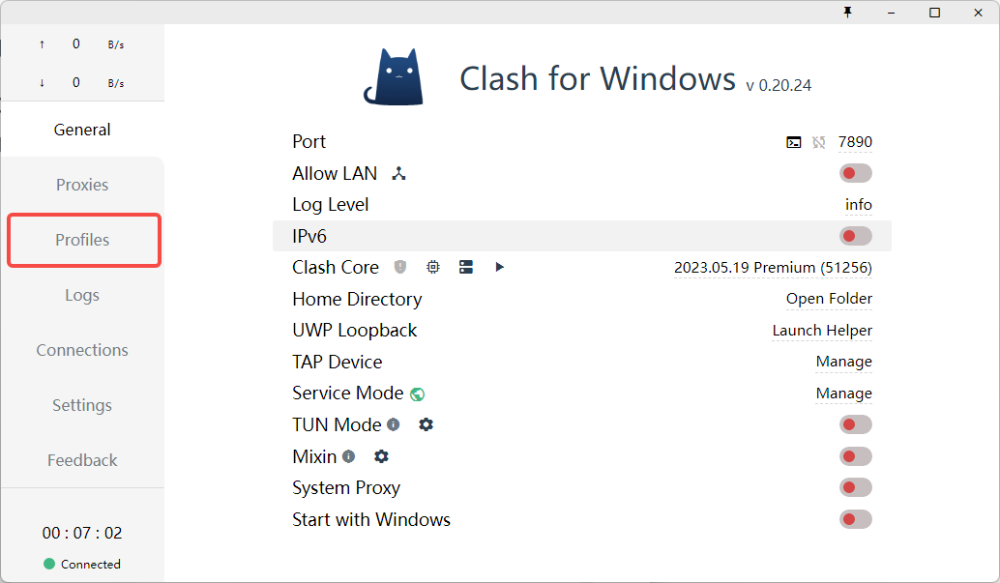
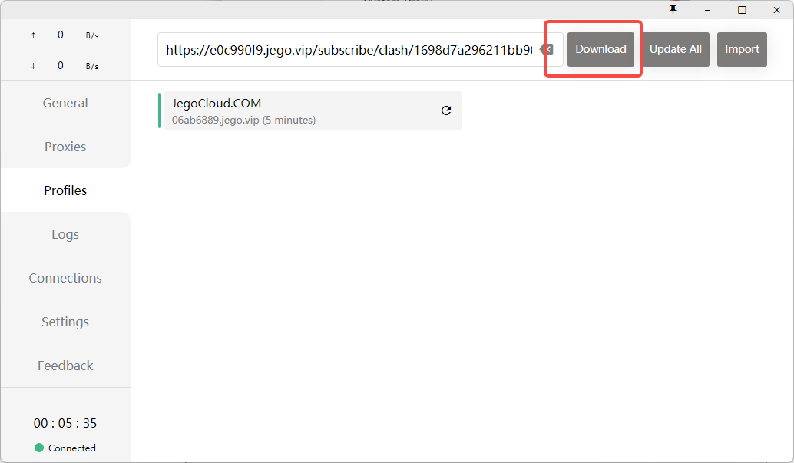
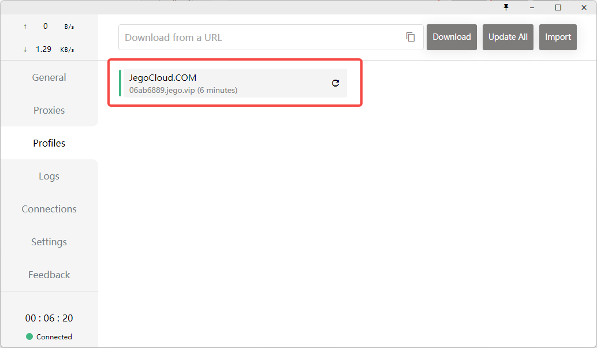
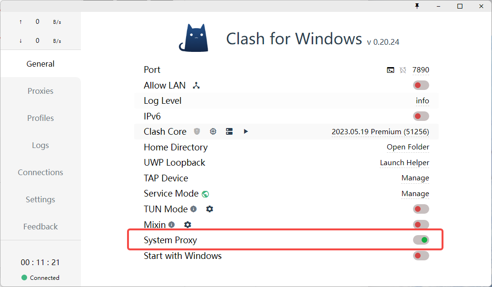
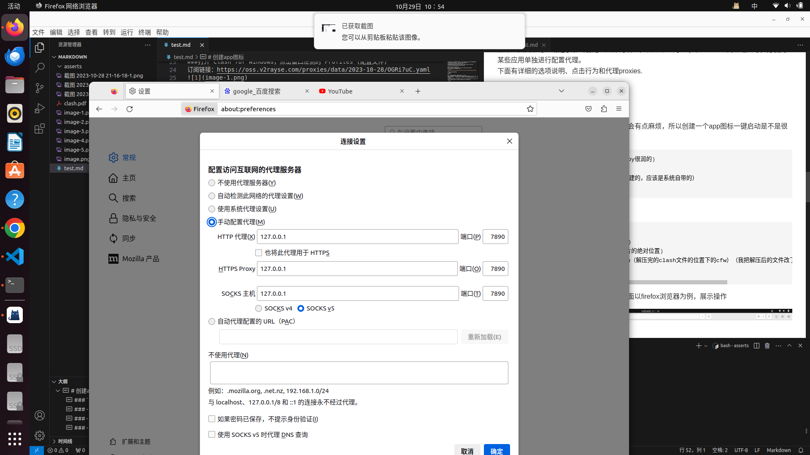
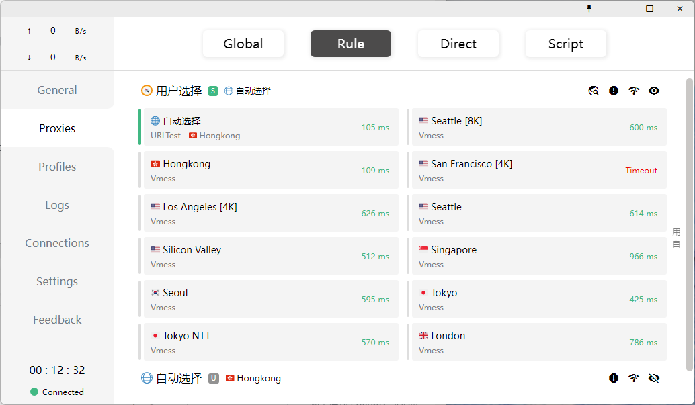
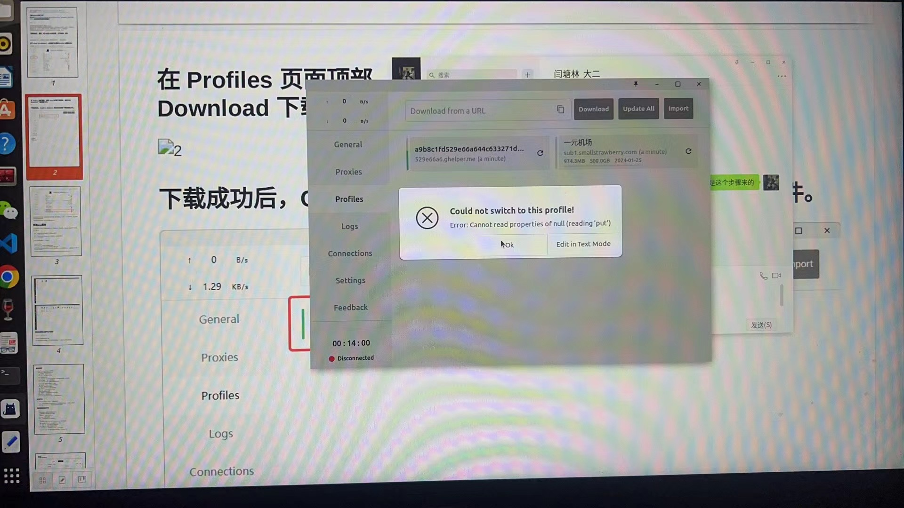

# clash教程
clash整个流程的参考资料：https://www.youtube.com/watch?v=VOlWdNZAq_o
导入节点的参考：https://www.cfmem.com/2021/09/linux-clash-for-windows-vpnv2ray.html
官方文档参考：https://docs.cfw.lbyczf.com/contents/urlscheme.html#%E4%B8%8B%E8%BD%BD%E9%85%8D%E7%BD%AE
汉化插件教程：https://clashforwindows.org/clash-for-windows-chinese/
### 下载ubuntu环境下的clash:
https://github.com/Fndroid/clash_for_windows_pkg/releases.  
如果出现登陆不进去的情况，尝试
```shell
 git clone https://github.com/Fndroid/clash_for_windows_pkg/releases
```
此处我的电脑在终端输入 
```shell
uname -m
```
这是看我的电脑的处理器架构，终端输出 x86_64
应该安装与你的计算机硬件架构相匹配的操作系统版本。如果 uname -m 返回 "x86_64"，那就表示计算机是基于 x86_64 或 x64 架构的 64 位系统，因此应该安装 64 位 x86_64 操作系统。
所以我安装的安装包为x64系统的 Clash.for.Windows-0.20.39-x64-linux.tar.gz
###下载完成后，提取，进入包含cfw的目录，打开终端，输入
```shell
./cfw
```
  运行当前目录下名为 "cfw" 的脚本文件,这是一种相对路径的写法，"./" 表示当前目录。
###打开 Clash for Windows，点击窗口左侧的 Profiles (配置文件)
订阅链接：https://oss.v2rayse.com/proxies/data/2023-10-28/OGRi7uC.yaml

###在 Profiles 页面顶部，粘贴 Clash 配置订阅链接，随后点击 Download 下载配置文件。

###下载成功后，Clash for Windows 将自动切换至下载的配置文件。

使用说明
  常规 General

在常规页面下可以清楚了解当前配置文件的设置，譬如常规的 http 和 socks5 代理端口等，方便对某些应用单独进行配置代理。
当然，这时的浏览器仍然 使用不了魔法，下面以firefox浏览器为例，展示操作



# 汉化插件安装
打开这个教程 https://clashforwindows.org/clash-for-windows-chinese/
# 体验感觉
我感觉比起我的浏览器插件会有点慢，但是全局翻墙了，而且还很好找免费的订阅链接，很不错了。
下面有详细的选项说明、点击行为和代理proxies.
# 创建app图标
这个时候我们打开clash只能使用脚本打开，会有点麻烦，所以创建一个app图标一键启动是不是很润呢？【狗头】
```shell
mkdir Documents/soft(随便起名了，直接copy很润的)
cd ~/Documents/soft
cd ~/.local/share/applications（不是创建的，应该是系统自带的）
vim clash.desktop
```
然后在打开的终端输入"i"，开始插入
```shell
[Desktop Entry]
Name=clash for windows(自己给图标起的名)
Icon=/home/i/图片/clash.png(当图标的图片的绝对位置)
Exec=/home/i/Documents/soft/clash/cfw（解压完的clash文件的位置下的cfw）（我把解压后的文件改了位置，也改了名字，应注意）
Type=Application                           
```


### 最后给该脚本赋予执行权限
```shell
chmod +x clash.desktop
```
然后就可以去搜索找到clash辣。
至于教程里讲的浏览器配置，由于我的浏览器有插件，可以翻墙，所以并没有配置。

### 选项说明
- Port：Mixed(Http+Socks) 代理端口
- Allow LAN：是否允许局域网代理
  - 网络图标：显示网卡信息
- Log Level：Clash 核心日志等级
- IPV6: 是否启用 IPV6
- Home Directory：Clash 配置文件目录（不建议修改此目录下文件内容）
- GeoIP Database：GeoIP 数据库更新
- UWP Loopback：UWP 应用联网限制解除工具
- Service Mode: 虚拟网卡安装(TUN 模式)
  - 地球图标：显示 Service Mode 在线状态
- TUN Mode: 是否启用 TUN 模式
  - 设置图标：打开 TUN 模式设置面板
- TAP Device：虚拟网卡安装(TAP 模式)
- Mixin: 是否启用 Mixin 模式
  - 设置图标：启动编辑器修改 Mixin 配置
- System Proxy：系统代理开关
- Start with Windows/macOS/Linux：开机自启动开关
### 点击行为
- Clash for Windows（标题）：快速重启软件
- v x.x.x: 当显示new提示时可以直接点击下载新版安装包 (每隔 6 小时检查一次更新)
- Connected/Disconnected：文件夹中显示当前日志文件
### 右侧对应点击行为
- Port:
    - 终端图标: 使用命令行设置系统代理
    - 循环图标: 随机设置 Mixed 端口
    - 端口号：修改 Mixed Port
- Log Level: 设置日志类型
- IPv6：设置是否启用 IPv6 连接逻辑
- Clash Core
    - 盾牌图标: 添加 Allow LAN 与 System Stack 的防火墙规则
    - 内核版本号: 打开 Clash 内核控制 Web 页面
- UWP Loopback：快速打开回环代理限制器
- Home Directory：快速打开配置文件目录
- GeoIP Database：点击更新 GeoIP 库 （macOS 可用）
- TAP Device：打开 TAP 模式虚拟网卡控制面板（Windows 可用）
###代理 Proxies

代理页面主要的作用就是切换代理模式和切换节点
切换代理模式
Clash 共有三种工作模式：
- 全局（Global）：所有请求直接发往代理服务器
- 规则（Rule）：所有请求根据配置文件规则进行分流
- 直连（Direct）：所有请求直接发往目的地
切换不同模式时，对应的节点列表会对应变化
###切换节点
###TIP
延迟测试(网络图标)可测试所有节点的延迟，可在Settings→Latency Test URL修改测试URL
节点按照策略组分开，并可以以组为单位进行延迟测试，可以方便选出延迟更低的节点。
## 可能的问题
